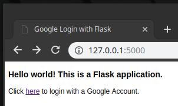
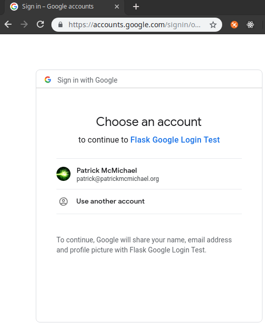
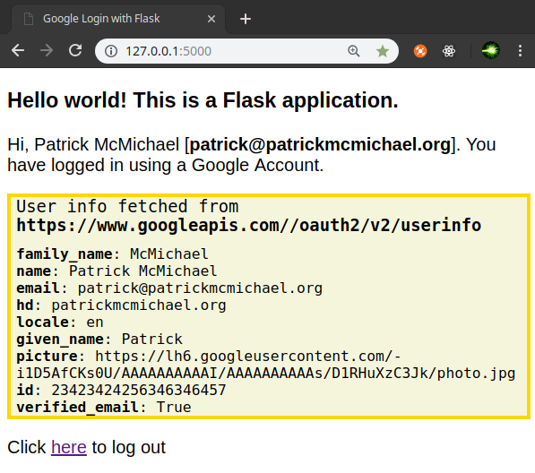

If you are building a Flask application that includes user authentication you may have considered adding the ability for users to authenticate using a third-party account such as Google, Facebook or Twitter. I will show an example Flask application which uses Google as an authentication provider. However, it will be very straightforward to add support for other providers too.

Before I get to the Flask app, I want to quickly go over some OAuth 2 basics. If you wish to skip ahead to the example Flask app click [here](#the-example-application).

## OAuth 2 and OpenID Connect

[OAuth 2](https://oauth.net/2/) is a specification or standard which can enable applications to obtain (limited) access to data on another service such as Google, Facebook or Spotify for example. Services may authorize access to different levels of data ranging from basic account information all the way to wanting access to your emails ([Gmail API](https://developers.google.com/gmail/api/guides/)). Specifically, OAuth 2 is an authorization framework. It does not specify exactly how services should handle authentication.

[OpenID Connect](https://openid.net/connect/) is an identity layer built on top of OAuth 2. OpenID Connect is helpful because it defines some extra steps to the OAuth 2 flow which make federated authentication possible. One of the main steps is the returning of an *id_token* from the authorization server. This token is usually a JSON Web Token ([JWT](https://jwt.io/)) which serializes various data such as *iss* (issuer) and *iat* (issued at). They can include additional data. For example, Google's id_tokens do include email addresses (assuming 'email' is part of the scope you specified when initiating the request).

### The General Flow

The general back and forth login flow between a client (you, the user), a website (consumer) and the auth provider can look something like this:

1. Client initiates request to sign in.
2. The consumer redirects client to authentication provider.
3. The provider displays a sign in page, usually with some information on the consumer including what they have requested access to. Some providers may allow the client to modify the permissions requested. For authentication, usually basic profile information is all that is requested (email, name etc).
4. The client confirms they wish to continue signing in. The provider creates a URL that directs them back to the consumer. This URL will contain *state* and *code* parameters.
5. The consumer verifies the *state* token has not changed. The consumer then makes a request to the provider and passes along the *code* which is verified by the provider.
6. If verification succeeds, the provider creates an *access token* and then returns this to the consumer.
7. Once the consumer has the *access token*, they can log the user in. They can use the *access token* to possibly make more requests on behalf of the client.

For more detail on the OAuth 2 flow check [Digital Ocean's](https://www.digitalocean.com/community/tutorials/an-introduction-to-oauth-2) article which goes into a good amount of detail.

For this example Flask application I will be using [Google](https://developers.google.com/identity/protocols/OpenIDConnect) as an authentication provider. Their implementation conforms to OpenID Connect.

## The Example Application

### Getting the credentials

1. To be able to use Google as an authentication provider for our application we need to register an application in the [Google developer console](https://console.developers.google.com/apis/credentials). Create a new 'project' for this.

2. Select *Create credentials* and then *OAuth client id*. Choose *Web application* for *Application type*.

3. Choose a *name* for the application and add *http://localhost:5000/google/authorized* to the *Authorised redirect URIs* section. Click save and make a note of the Client Secret and Client ID displayed.


### Install dependencies

```
$ pip install flask flask-dance[sqla] flask-sqlalchemy blinker
```

I am using [Flask-Dance](https://github.com/singingwolfboy/flask-dance) because it is actively maintained, well documented and comes with quite a lot of built in providers.

### The Code

```python
import os

from flask import Flask, render_template, redirect, url_for
from flask_sqlalchemy import SQLAlchemy
from flask_login import (LoginManager, UserMixin,
                         current_user, login_user, logout_user)
from flask_dance.consumer import oauth_authorized
from flask_dance.contrib.google import make_google_blueprint, google
from flask_dance.consumer.backend.sqla import (OAuthConsumerMixin,
                                               SQLAlchemyBackend)


os.environ['OAUTHLIB_INSECURE_TRANSPORT'] = '1'

path = os.path.dirname(os.path.realpath(__file__))
db_path = os.path.join(path, 'app.db')

app = Flask(__name__)
app.config['SQLALCHEMY_DATABASE_URI'] = 'sqlite:///' + db_path
app.config['SQLALCHEMY_TRACK_MODIFICATIONS'] = False
app.config['SECRET_KEY'] = 'YOUR-SECRET-KEY-HERE'

db = SQLAlchemy(app)
login_manager = LoginManager()
login_manager.init_app(app)
login_manager.login_view = 'google.login'


class User(db.Model, UserMixin):
    id = db.Column(db.Integer, primary_key=True)
    email = db.Column(db.String(256), unique=True)
    name = db.Column(db.String(256))


class OAuth(OAuthConsumerMixin, db.Model):
    provider_user_id = db.Column(db.String(256), unique=True)
    user_id = db.Column(db.Integer, db.ForeignKey('user.id'))
    user = db.relationship(User)


@login_manager.user_loader
def load_user(user_id):
    return User.query.get(int(user_id))


google_blueprint = make_google_blueprint(
    client_id='YOUR-CLIENT-ID-HERE',
    client_secret='YOUR-CLIENT-SECRET-HERE',
    scope=['https://www.googleapis.com/auth/userinfo.email',
           'https://www.googleapis.com/auth/userinfo.profile'],
    offline=True,
    reprompt_consent=True,
    backend=SQLAlchemyBackend(OAuth, db.session, user=current_user)
)

app.register_blueprint(google_blueprint)


@app.route('/')
def index():
    google_data = None
    user_info_endpoint = '/oauth2/v2/userinfo'
    if current_user.is_authenticated and google.authorized:
        google_data = google.get(user_info_endpoint).json()
    return render_template('index.j2',
                           google_data=google_data,
                           fetch_url=google.base_url + user_info_endpoint)


@app.route('/logout')
def logout():
    logout_user()
    return redirect(url_for('index'))


@oauth_authorized.connect_via(google_blueprint)
def google_logged_in(blueprint, token):
    resp = blueprint.session.get('/oauth2/v2/userinfo')
    user_info = resp.json()
    user_id = str(user_info['id'])
    oauth = OAuth.query.filter_by(provider=blueprint.name,
                                  provider_user_id=user_id).first()
    if not oauth:
        oauth = OAuth(provider=blueprint.name,
                      provider_user_id=user_id,
                      token=token)
    else:
        oauth.token = token
        db.session.add(oauth)
        db.session.commit()
        login_user(oauth.user)
    if not oauth.user:
        user = User(email=user_info["email"],
                    name=user_info["name"])
        oauth.user = user
        db.session.add_all([user, oauth])
        db.session.commit()
        login_user(user)

    return False
```

### The Template

```django

<!doctype html>
<html class="no-js" lang="">

<head>
  <title>Google Login with Flask</title>
  <style>
  body {
    font-family: sans-serif;
  }
  .info {
    margin: 0;
    padding-left: 5px;
    border: solid gold 3px;
    background-color: beige;
    font-family: monospace;
  }
  .info p {
    margin:  0;
  }
  .info p:first-child {
    font-size: 15px;
    padding-bottom: 10px;
  }
</style>
</head>

<body>

  <h3>Hello world! This is a Flask application.</h3>
  
    <p>Click <a href="/google">here</a> to login with a Google Account.</p>
  
    <p>Hi, {{ current_user.name }} [<strong>{{ current_user.email }}</strong>]. You have logged in using a Google Account.</p>
  
    <div class="info">
      <p>User info fetched from <strong>{{ fetch_url }}</strong></p>
      
        <p><strong>{{ key }}</strong>: {{ value }}</p>
      
    </div>
  
    <p>Click <a href="/logout">here</a> to log out</p>
  

</html>
```

### Code Walkthrough

I will walkthrough the code in chunks.

```python
os.environ['OAUTHLIB_INSECURE_TRANSPORT'] = '1'

path = os.path.dirname(os.path.realpath(__file__))
db_path = os.path.join(path, 'app.db')

app = Flask(__name__)
app.config['SQLALCHEMY_DATABASE_URI'] = 'sqlite:///' + db_path
app.config['SQLALCHEMY_TRACK_MODIFICATIONS'] = False
app.config['SECRET_KEY'] = 'YOUR-SECRET-KEY-HERE'

db = SQLAlchemy(app)
login_manager = LoginManager()
login_manager.init_app(app)
login_manager.login_view = 'google.login'

```

Setting the *OAUTHLIB_INSECURE_TRANSPORT* environment variable allows the OAuth library to work even when using HTTP. Obviously, this should not be used in production.

The rest is basic setup including the path to the sqlite database file. We will be using Flask-Login to handle the session-based logins. Setting the *login_view* here doesn't do much but if you wanted to protect certain views, you can have your app automatically redirect the user to the appropriate login page.


```python
class User(db.Model, UserMixin):
    id = db.Column(db.Integer, primary_key=True)
    email = db.Column(db.String(256), unique=True)
    name = db.Column(db.String(256))


class OAuth(OAuthConsumerMixin, db.Model):
    provider_user_id = db.Column(db.String(256), unique=True)
    user_id = db.Column(db.Integer, db.ForeignKey('user.id'))
    user = db.relationship(User)
```

We are using a separate model to store the OAuth token and related data. Using a separate model like this could allow you to support multiple authentication methods for a single user account.

The *UserMixin* adds some methods required by Flask-Login. The *OAuthConsumerMixin* adds id, provider, created_at and token columns. I have included the *provider_user_id* column which will be the users unique identifier.


```python
google_blueprint = make_google_blueprint(
    client_id='YOUR-CLIENT-ID-HERE',
    client_secret='YOUR-CLIENT-SECRET-HERE',
    scope=['https://www.googleapis.com/auth/userinfo.email',
           'https://www.googleapis.com/auth/userinfo.profile'],
    offline=True,
    reprompt_consent=True,
    backend=SQLAlchemyBackend(OAuth, db.session, user=current_user)
)

app.register_blueprint(google_blueprint)
```

Here we are using Flask-Dance's blueprint factory which we register to our app. Setting offline to true means we will receive a refresh_token allowing the access token to be renewed without the user having to go through the authorization flow again. Read more about 'offline' access tokens [here](https://developers.google.com/identity/protocols/OAuth2WebServer#offline).

The default backend uses the Flask session object to store OAuth tokens. Here we are using the SQLAlchemy backend. There are considerations to make when choosing where exactly you store tokens. [Auth0.com](https://auth0.com/docs/security/store-tokens) have a useful article discussing this.


```python
@app.route('/')
def index():
    google_data = None
    user_info_endpoint = '/oauth2/v2/userinfo'
    if current_user.is_authenticated and google.authorized:
        google_data = google.get(user_info_endpoint).json()
    return render_template('index.j2',
                           google_data=google_data,
                           fetch_url=google.base_url + user_info_endpoint)
```

The homepage of our application will simply display a link to login if the user has not done so already. When they are logged in, we fetch some user data (to prove we can) from the *userinfo* endpoint. We then display this data to the user.

```python
@oauth_authorized.connect_via(google_blueprint)
def google_logged_in(blueprint, token):
    resp = blueprint.session.get('/oauth2/v2/userinfo')
    user_info = resp.json()
    user_id = str(user_info['id'])
    oauth = OAuth.query.filter_by(provider=blueprint.name,
                                  provider_user_id=user_id).first()
    if not oauth:
        oauth = OAuth(provider=blueprint.name,
                      provider_user_id=user_id,
                      token=token)
    else:
        oauth.token = token
        db.session.add(oauth)
        db.session.commit()
        login_user(oauth.user)
    if not oauth.user:
        user = User(email=user_info["email"],
                    name=user_info["name"])
        oauth.user = user
        db.session.add_all([user, oauth])
        db.session.commit()
        login_user(user)

    return False
```

We are using the *@oauth_authorized* signal which allows us to perform some actions when the token has been successfully retrieved from the authorization server. It takes the specific blueprint as a first argument and the token as the second. This function could be generalised to take a different providers blueprint e.g. GitHub, Facebook. You could then just add multiple *oauth_authorized* decorators, one for each provider.

In this function we are trying to load the OAuth object if it exists. If it does not exist, we create a new one and pair it with a new User too. We return False to prevent the default behaviour of Flask-Dance which would be to set the token on the backend (but we have done that ourselves).

This kind of user creation is common. Sites usually do not expect a user to create an account and then tie the account to an OAuth provider. They wish to use their OAuth provider and have an account setup and be associated for them. But it is worth thinking about the different kinds of account creation and what the relationship between a user and a third-party authentication provider looks like.

## The Running Application

Below are some screenshots of the application running.







You can view the sample Flask application on GitHub [here](https://github.com/Saturn/flask-google-auth-example).

## Useful Resources and Further Reading

- [Flask-Dance](https://github.com/singingwolfboy/flask-dance)
- [An Introduction to OAuth 2 (Digital Ocean)](https://www.digitalocean.com/community/tutorials/an-introduction-to-oauth-2)
- [Google OpenID Connect Guide](https://developers.google.com/identity/protocols/OpenIDConnect)
- [Auth0 docs](https://auth0.com/docs/getting-started)
